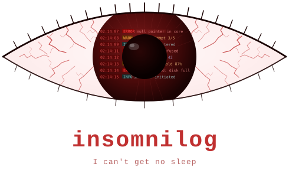

# insomnilog

  

`insomnilog` is an asynchronous Rust logging library designed for real-time and
latency-sensitive applications. All logging on the hot path is **zero-allocation**
and **lock-free** — log records are serialised as raw bytes into a per-thread
ring buffer and decoded by a background worker thread.

## Design goals

- **Real-time safe hot path.** The logging macros never allocate heap memory,
  never acquire a lock, and never block. They perform a level check, encode
  arguments directly into a pre-allocated ring buffer, and return. They never "sleep".

- **Asynchronous by default.** Formatting, sink dispatch, and I/O happen on a
  dedicated backend worker thread. The calling thread pays only the cost of the
  ring-buffer write.

- **Explicit configuration, no global magic.** You start the backend once with
  `insomnilog::start(opts)`, create named loggers and sinks explicitly, and pass
  a logger reference to each call site. There is no implicit global logger, no
  auto-start, and no hidden process-exit hook.

- **Composable sinks.** A `Sink` receives a decoded `LogRecord` and decides its
  own output format. One sink can write human-readable text, another can write
  structured JSON, a third can forward to a metrics system — all from the same
  logger.

## Documentation

- **[User guide](insomnilog/docs/)** — Quick start, core concepts, formatters,
  sinks, preallocating thread queues, and more.
- **[Examples](examples/)** — Runnable examples covering common use cases.
- **[Contributing](CONTRIBUTING.md)** — Development tooling, CI pipeline, and
  how to extend the project.
- **[Architecture Decision Records](adr/)** — The reasoning behind the key
  architectural choices. A good entry point for understanding why the library
  is designed the way it is.

## Contributing

Contributions and bug reports are welcome. See [CONTRIBUTING.md](CONTRIBUTING.md) for the full details on tools, CI checks, and conventions.
