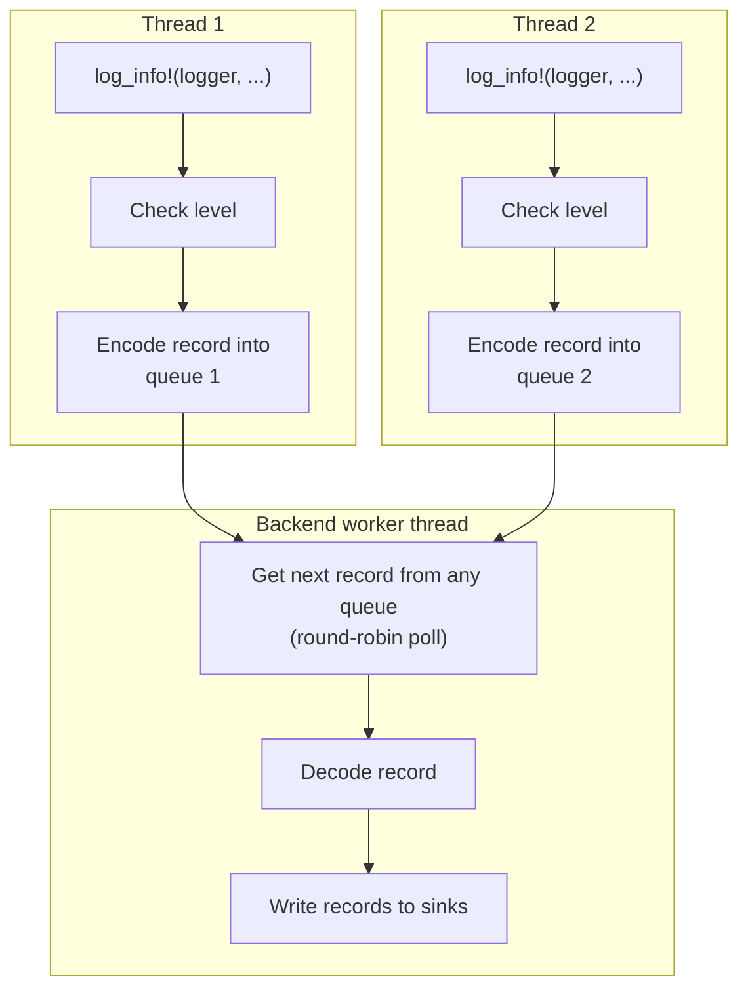

# Architecture

`insomnilog` splits logging into two distinct phases: a **hot path** on the
calling thread and **background processing** on a dedicated worker thread.
This separation is what allows the hot path to be zero-allocation and lock-free.

## Component overview

## Hot path: what happens on the calling thread

When you write `log_info!(logger, "user {} logged in", username)` the macro
expands to roughly:

1. **Level check** If the record
   is below the threshold the macro returns immediately with no further work.

2. **Header construction** — a `static LogMetadata` is generated at the call
   site at compile time (file, line, level). The header written to the buffer
   also carries a raw `*const Logger` pointer so the backend can reach the
   logger's sink list without a registry lookup.

3. **Encode into the queue** — Reserves a contiguous
   slice in the per-thread SPSC queue, then writes the fixed-size
   header followed by each argument encoded as typed bytes.
   No heap allocation, no format string, no lock.
   If the queue is
   full the record is silently dropped — the calling thread is never blocked.

The per-thread queue is allocated lazily on the first log call from a new
thread. Latency-sensitive threads can call [`preallocate_thread`] during
startup to pay that cost upfront and keep every subsequent log call on the
fast path.

## Background processing: what happens on the worker thread

The backend worker polls all known per-thread queues in a round-robin. For
each queue it processes a limited number of records per pass before moving to the next,
ensuring no single high-volume thread starves the others.

For each record it finds:

1. **Decode** — the raw bytes are decoded into a log record containing the
   log level, timestamp, source location, and typed argument values.

2. **Logger dispatch** — the `*const Logger` in the record header is
   dereferenced to obtain `&Logger`. This is safe because the logger registry
   holds a strong `Arc<Logger>` for the entire process lifetime, guaranteeing
   the pointer remains valid.

3. **Sink fan-out** — the worker iterates `logger.sinks` and calls
   `Sink::write_record(&record)` on each one whose level filter passes. The
   entire fan-out is wrapped in `std::panic::catch_unwind` so a panicking sink
   cannot take down the backend.
